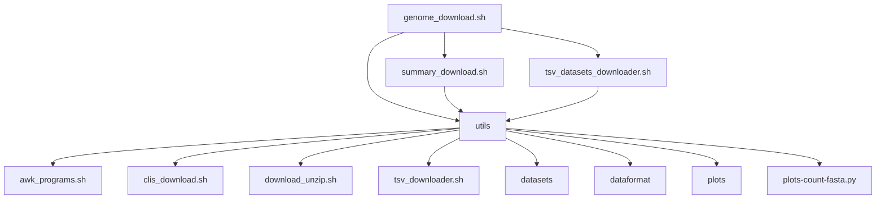

# cnsg-downloader-code

download scripts for [NCBI Datasets command-line tools](https://www.ncbi.nlm.nih.gov/datasets/docs/v2/command-line-tools/download-and-install/).


## Installation

First, git clone this repo and let it have execution permissions.
```
git clone https://github.com/jovillarrealm/cnsg-downloader-code.git
find cnsg-downloader-code -type f -exec chmod +x {} \;
```

And please set the variable NCBI_API_KEY in your environment.

Optionally test its behaviour by downloading genomes and annotations for Aphelenchoides, this will also install any necesary tools. specifically the [NCBI Datasets command-line tools](https://www.ncbi.nlm.nih.gov/datasets/docs/v2/command-line-tools/download-and-install/), [count-fasta-rs](https://github.com/jovillarrealm/count-fasta-rs), and [uv](https://github.com/astral-sh/uv).

```
cnsg-downloader-code/downloadGenome.sh -i Aphelenchoides -o ./Aphelenchoides -l 0
```
```
cnsg-downloader-code/downloadGenome.sh -i Aphelenchoides -o ./Aphelenchoides --annotate=true
```


## NCBI_API_KEY

Get your own API KEY from your account at the [ncbi page](https://www.ncbi.nlm.nih.gov/).

Like this.

https://github.com/user-attachments/assets/58a8a205-8726-4a35-a8d8-db75650525d2

This approach lasts for a session so please modify your configurations files to make this last. These could be .bashrc .zshrc .profile


## Usage 

Just call any script without arguments and they will show their usage. Try getting the..

Output for `./genome_download.sh`

Output for `./summary_download.sh`

Output for `./tsv_datasets_downloader.sh`

## Hierarchy



