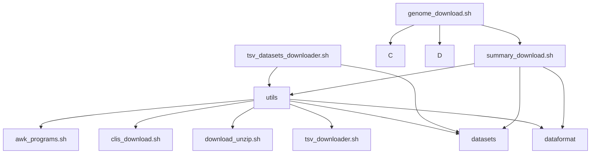

# cnsg-downloader-code

## Hierarchy


download scripts for [NCBI cli tools](https://www.ncbi.nlm.nih.gov/datasets/docs/v2/command-line-tools/download-and-install/).


Output for `./genome_download.sh`

```
Usage: ./genome_download.sh -i <taxon> [-o <directory_output>] [-a path/to/api/key/file] [-p prefered prefix] [--keep-zip-files=true] [--convert-gzip-files=true] [--annotate=true]


Arguments:
-i <taxon>    Can be a name or NCBI Taxonomy ID
-o            rel path to folder where GENOMIC*/ folders will be created [Default: ./]
-p            tsv_downloader performs deduplication of redundant genomes between GenBank and RefSeq [Default: 'both']
              [Options: 'GCF 'GCA' 'all' 'both']

'GCA' (GenBank), 'GCF' (RefSeq), 'all' (contains duplication), 'both' (prefers RefSeq genomes over GenBank)

-a            path to file containing an NCBI API key. If you have a ncbi account, you can generate one. If it's not passed, this script tries to get it from env.
-r            specify with any string to download only reference genomes
-l <Number>   limit the summary to the first <Number> of genomes

INFO: An NCBI API key can be aquired from this environment

--keep-zip-files=true  ensures downloaded genomes are not decompressed after download, also it renames the inner fna file (without recompressing it)

--convert-gzip-files  ensures downloaded genomes are not recompressed after download into a gz file

--annotate=true   adds gff annotations


Example usage:
cnsg-downloader-code/downloadGenome.sh -i Aphelenchoides -o ./Aphelenchoides -a ./ncbi_api_key.txt -p all
cnsg-downloader-code/downloadGenome.sh -i 90723 -o ./Aphelenchoides -a ncbi_api_key.txt -p 'both'

This script assumes unzip is installed and next to
summary_download and tsv_downloader.sh and clis_download.sh

date format is %d-%m-%Y
```

Output for `./summary_download.sh`

```
Usage: ./summary_download.sh -i <taxon> [-o <directorio_output>] [-a path/to/api/key/file] [-p source-db] [-r true]


Arguments:
-i <taxon>    Can be a name or NCBI Taxonomy ID
-o            rel path to folder where GENOMIC*/ folders will be created [Default: ./]
-a            path to file containing an NCBI API key. If you have a ncbi account, you can generate one.
-p            chooses between GenBank and RefSeq [Default: 'both']
              [Options: 'GCF 'GCA' 'all' 'both']
'GCA' (GenBank), 'GCF' (RefSeq), 'all' (contains duplication), 'both' (prefers RefSeq genomes over GenBank)
-r            chooses to download only reference genomes
-l <Number>   limit the summary to the first <Number> of genomes

-g            gene symbol to search with the taxon. The taxon must be at least at species level, or below.


This script assumes 'datasets' and 'dataformat' are in PATH
```
Output for `./tsv_datasets_downloader.sh`

```
Usage: ./tsv_datasets_downloader.sh -i tsv/input/file/path [-o path/for/dir/GENOMIC] [-a path/to/api/key/file] [-p preferred prefix] [--keep-zip-files=true] [--annotate=true]


Arguments:
-i            path to tsv file with datasets summary output
-o            rel path to folder where GENOMIC*/ folders will be created [Default: ./]
-a            path to file containing an NCBI API key. If you have a ncbi account, you can generate one.
-p            tsv_downloader performs deduplication of redundant genomes between GenBank and RefSeq [Default: 'both']
              [Options: 'GCF 'GCA' 'all' 'both']
-b            batch size of each GENOMIC folder because even 'ls' starts to fail with directories with too many files [Default: 50_000]

'GCA' (GenBank), 'GCF' (RefSeq), 'all' (contains duplication), 'both' (prefers RefSeq genomes over GenBank)

--keep-zip-files=true  ensures downloaded genomes are not decompressed after download, also it renames the inner fna file (without recompressing it)

--convert-gzip-files  ensures downloaded genomes are not recompressed after download into a gz file

--annotate=true   adds gff annotations

This script assumes 'datasets' and 'dataformat' are in PATH
It depends on mv, unzip, awk, xargs, datasets, dataformat, zipnote
```